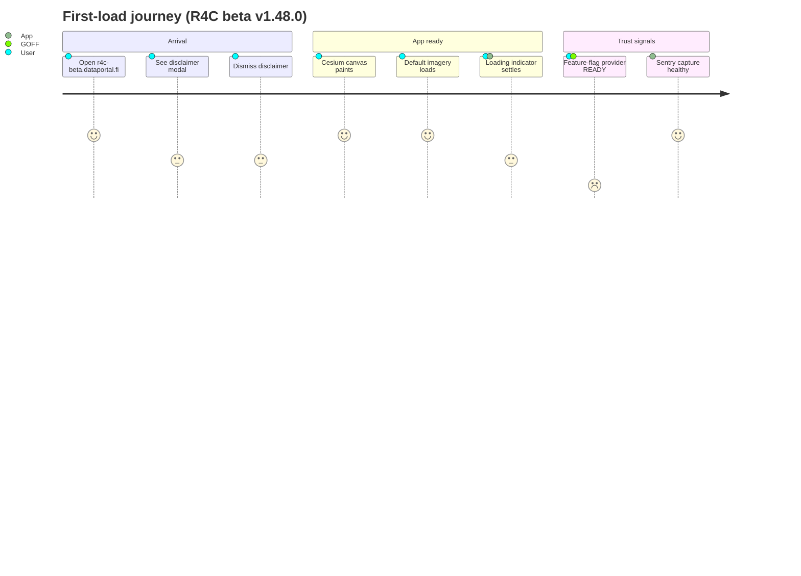
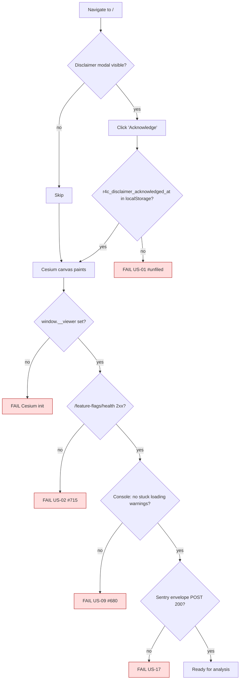

# Journey 1 — Onboarding & first load

The persona arrives at `https://r4c-beta.dataportal.fi/`. Before any analysis they must:

1. Dismiss the disclaimer (only once per "reasonable window").
2. See an interactive map (Cesium ready, default imagery loaded).
3. Trust that feature flags are live (GOFF `READY`, not silently falling back to compile-time defaults).
4. Trust that the loading indicator settles — no stuck spinners.
5. Have error monitoring active (Sentry envelope POST succeeds).

## Persona satisfaction journey

## Flow & assertions

## Coverage

| Step                            | Story      | Assertion                                                                                         | Test                                                    |
| ------------------------------- | ---------- | ------------------------------------------------------------------------------------------------- | ------------------------------------------------------- |
| Disclaimer present on cold load | US-01      | `[role="dialog"]` with "Demo only" text is attached                                               | `onboarding-first-load` (new)                           |
| Dismissal persists              | US-01      | After click + reload, modal NOT attached and `localStorage.r4c_disclaimer_acknowledged_at` is set | `onboarding-first-load` (new) — expected fail until fix |
| GOFF reachable                  | US-02      | Network: no `5xx` on `**/feature-flags/health`                                                    | `onboarding-first-load` — expected fail until #715      |
| Cesium ready                    | structural | `window.__viewer` truthy and canvas has non-zero dims                                             | covered by `cesium-fixture`                             |
| No stuck loading                | US-09      | Console warns matching `/stale loading state/i` ≤ 5 within 10s of idle                            | `onboarding-first-load`                                 |
| Sentry healthy                  | US-17      | At least one `POST **/ingest.us.sentry.io/**/envelope/` returns 2xx                               | `onboarding-first-load`                                 |
