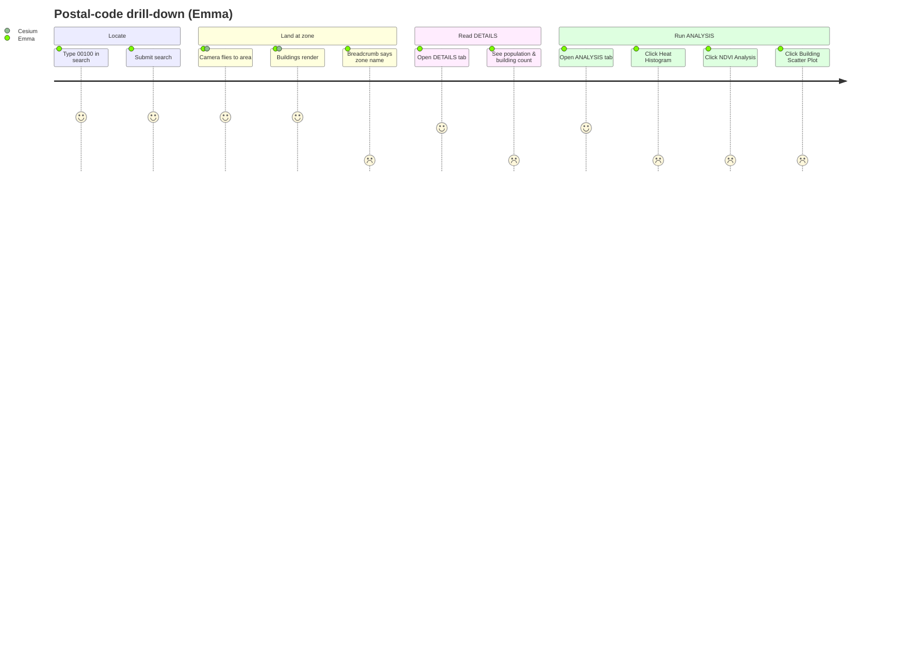
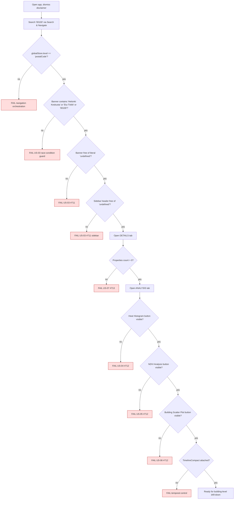
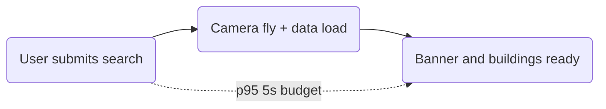

# Journey 2 — Drill into postal code 00100 and run analysis

Emma wants to validate heat exposure for a single postal code (00100, Helsinki Keskusta — Etu-Töölö). She:

1. Searches for `00100` (deterministic equivalent to clicking the polygon).
2. Reads the breadcrumb to confirm the area.
3. Inspects DETAILS tab for demographic context.
4. Opens ANALYSIS tab and runs Heat Histogram, NDVI Analysis, and Building Scatter Plot.

This journey concentrates the bulk of audit failures (US-03, US-04, US-05, US-06, US-07). Until those are fixed, the spec is expected to fail on those exact assertions — that is the point.

## Persona satisfaction journey

## Flow & assertions

## Performance budget (US-19)

The spec records `Date.now()` between the search submit and the moment `globalStore.level === 'postalCode'`. Recorded in the test report for monitoring but **not asserted** (issue #687 is open and the 5s target will fail today).

## Coverage

| Step                            | Story      | Assertion                                                          | Test                                             |
| ------------------------------- | ---------- | ------------------------------------------------------------------ | ------------------------------------------------ | -------- | ---------------------------------------------------------- |
| Search reaches postalCode level | navigation | `window.globalStore.level === 'postalCode'` within 10s             | `journey-2-drilldown` (new)                      |
| Breadcrumb has zone name        | US-03      | banner contains `/Helsinki Keskusta                                | Etu-Töölö                                        | 00100/i` | `audit-2026-W19/postal-code-breadcrumb.spec.ts` (existing) |
| Breadcrumb has no 'undefined'   | US-03      | banner does NOT contain `/\bundefined\b/i`                         | existing                                         |
| DETAILS populated               | US-07      | DETAILS region text does NOT contain "0 properties"                | `journey-2-drilldown` — expected fail until #713 |
| Heat Histogram button           | US-04      | `getByRole('button', { name: /heat histogram/i })` is visible      | `journey-2-drilldown` — expected fail until #712 |
| NDVI Analysis button            | US-05      | `getByRole('button', { name: /ndvi analysis/i })` is visible       | `journey-2-drilldown` — expected fail until #712 |
| Building Scatter Plot button    | US-06      | `getByRole('button', { name: /scatter/i })` is visible             | `journey-2-drilldown` — expected fail until #712 |
| TimelineCompact attached        | structural | `.timeline-compact` is attached (not toBeVisible — responsive CSS) | `journey-2-drilldown`                            |
| 95p drilldown latency           | US-19      | record only — issue #687                                           | `journey-2-drilldown`                            |
