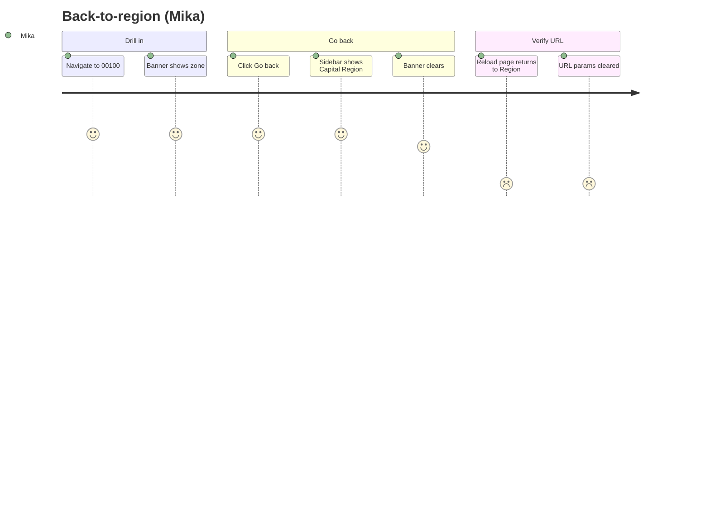
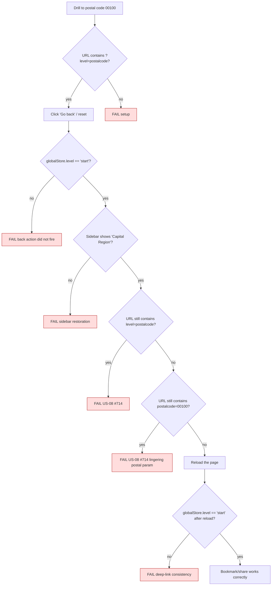

# Journey 3 — Back from postal code to region

Mika is comparing adjacent postal codes. After looking at 00100 he clicks "Go back" expecting to return to the Capital Region overview **and** to have the URL bar reflect that — so he can bookmark or share the region view.

The audit found this fails: the visual state goes back but the URL retains `?level=postalcode&postalcode=00100`, and a page reload would re-enter postal-code level.

## Persona satisfaction journey

## Flow & assertions

## Coverage

| Step                           | Story | Assertion                                                      | Test                                            |
| ------------------------------ | ----- | -------------------------------------------------------------- | ----------------------------------------------- |
| Drill to 00100 then back-nav   | US-08 | After back, `globalStore.level === 'start'`                    | `journey-3-back-nav` (new)                      |
| URL `level` param cleared      | US-08 | `new URL(page.url()).searchParams.has('level') === false`      | `journey-3-back-nav` — expected fail until #714 |
| URL `postalcode` param cleared | US-08 | `new URL(page.url()).searchParams.has('postalcode') === false` | `journey-3-back-nav` — expected fail until #714 |
| Reload preserves intent        | US-08 | After `page.reload()`, `globalStore.level === 'start'`         | `journey-3-back-nav`                            |
