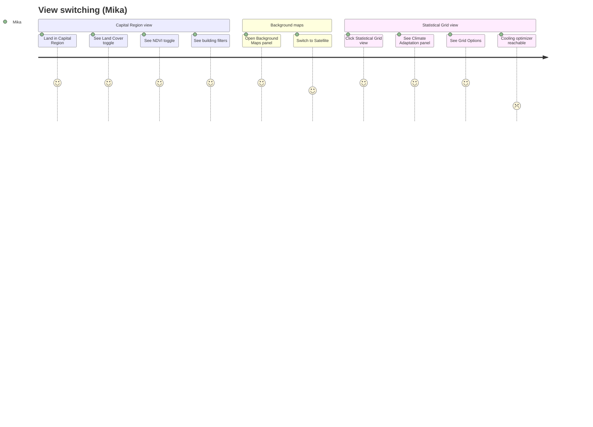
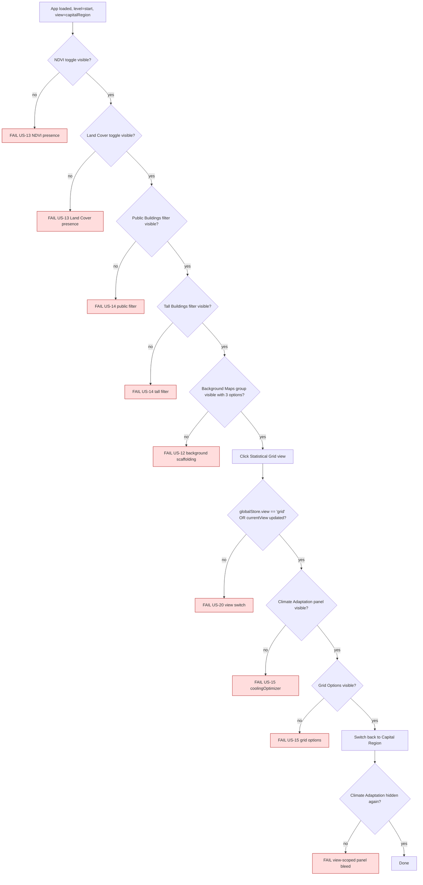

# Journey 4 — Switch between Capital Region and Statistical Grid

Mika scans Helsinki at the regional level using two complementary views: the Capital Region (postal-code polygons) and the Statistical Grid (250 m raster). He toggles data layers and filters in each, and expects the Climate Adaptation panel to appear when he's in Grid view.

This journey is mostly ✅ at the presence layer but every individual toggle's downstream effect remains 🟡 unverified in the audit. The flow encodes the structural expectations so a future regression won't silently break the panel scaffolding.

## Persona satisfaction journey

## Flow & assertions

## Coverage

| Step                                   | Story | Assertion                                                                 | Test                                                      |
| -------------------------------------- | ----- | ------------------------------------------------------------------------- | --------------------------------------------------------- |
| NDVI toggle present                    | US-13 | `getByText('NDVI', { exact: true })` visible                              | `journey-4-view-switch` (new)                             |
| Land Cover toggle present              | US-13 | `getByText('Land Cover')` visible                                         | `journey-4-view-switch`                                   |
| Building filters present               | US-14 | `getByText('Public Buildings')` and `getByText('Tall Buildings')` visible | `journey-4-view-switch`                                   |
| Background Maps options                | US-12 | "Default Map", "Satellite", "Terrain" entries visible                     | `journey-4-view-switch`                                   |
| View switch                            | US-20 | After click, `globalStore.view` (or equivalent) reads `grid`              | `journey-4-view-switch`                                   |
| Climate Adaptation appears in grid     | US-15 | `getByText('Climate Adaptation')` visible only when view === 'grid'       | overlaps `verifyPanelVisibility({ currentView: 'grid' })` |
| Climate Adaptation hidden outside grid | US-15 | not-visible when view === 'capitalRegion'                                 | `journey-4-view-switch`                                   |
