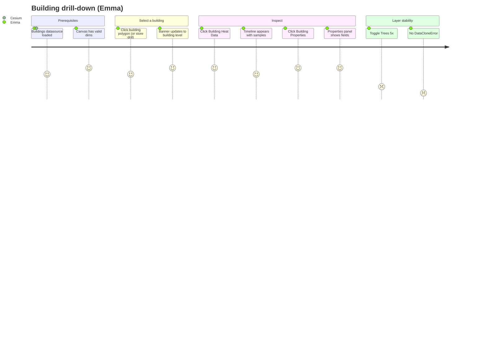
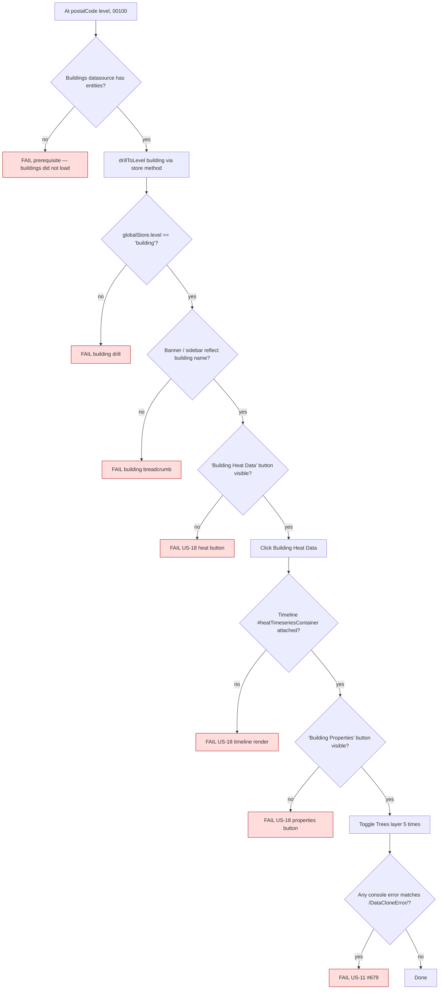

# Journey 5 — Drill from postal code to a single building

Emma already landed at postal code 00100 (Journey 2). She now wants to validate one building's heat exposure by clicking it, opening "Building Heat Data" and "Building Properties". This is the deepest level of the navigation hierarchy and the one most likely to surface state-coordination bugs (US-11 `DataCloneError` on tree-coverage toggle is the open example).

The audit could not reach building level in chrome-devtools because picking a Cesium polygon requires the building datasource to be loaded — the journey codifies the prerequisites the test must wait for.

## Persona satisfaction journey

## Flow & assertions

## Coverage

| Step                       | Story      | Assertion                                                                                    | Test                                            |
| -------------------------- | ---------- | -------------------------------------------------------------------------------------------- | ----------------------------------------------- |
| Buildings datasource ready | structural | `viewer.dataSources` has a "Buildings " entry with entities                                  | reused from CLAUDE.md guidance                  |
| Drill to building          | US-18      | `globalStore.level === 'building'`                                                           | `journey-5-building` (new)                      |
| Heat Data button           | US-18      | `getByRole('button', { name: 'Building Heat Data' })` visible (exact casing)                 | `journey-5-building`                            |
| Timeline renders           | US-18      | `#heatTimeseriesContainer` is attached                                                       | `journey-5-building`                            |
| Properties button          | US-18      | `getByRole('button', { name: 'Building Properties' })` visible                               | `journey-5-building`                            |
| Tree toggle stability      | US-11      | toggle Trees 5× with `dispatchEvent`, fail if any console message matches `/DataCloneError/` | `journey-5-building` — expected fail until #679 |
