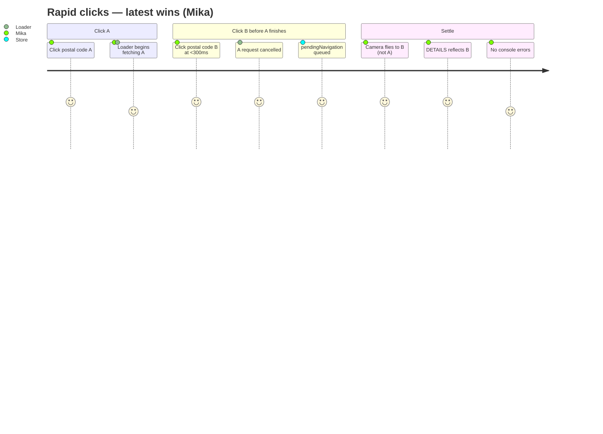
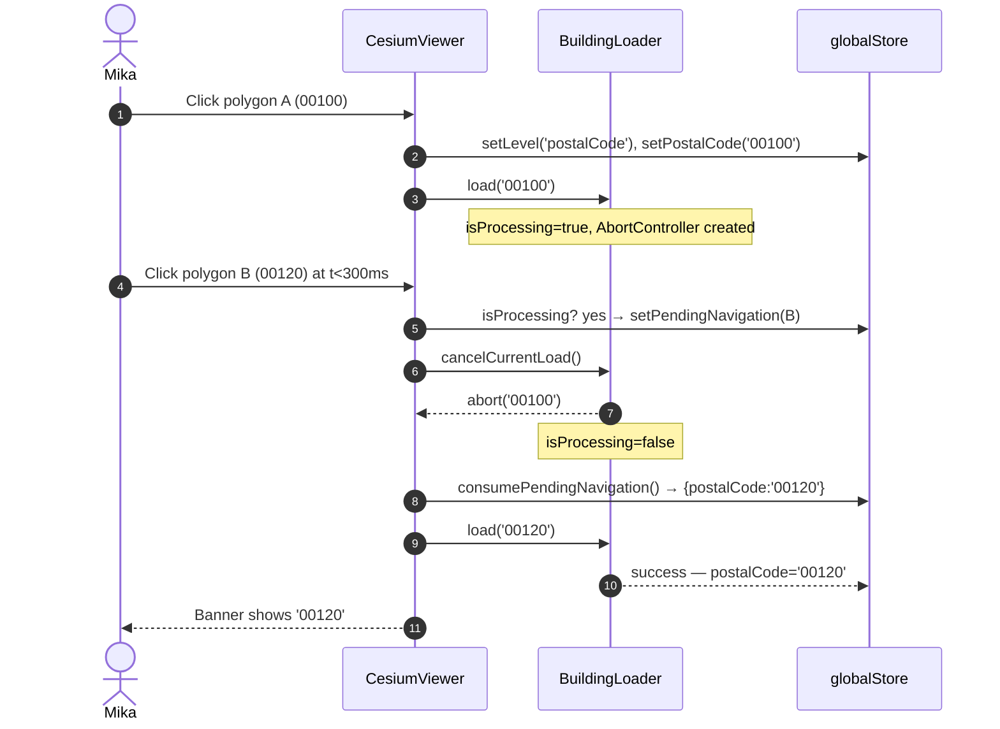
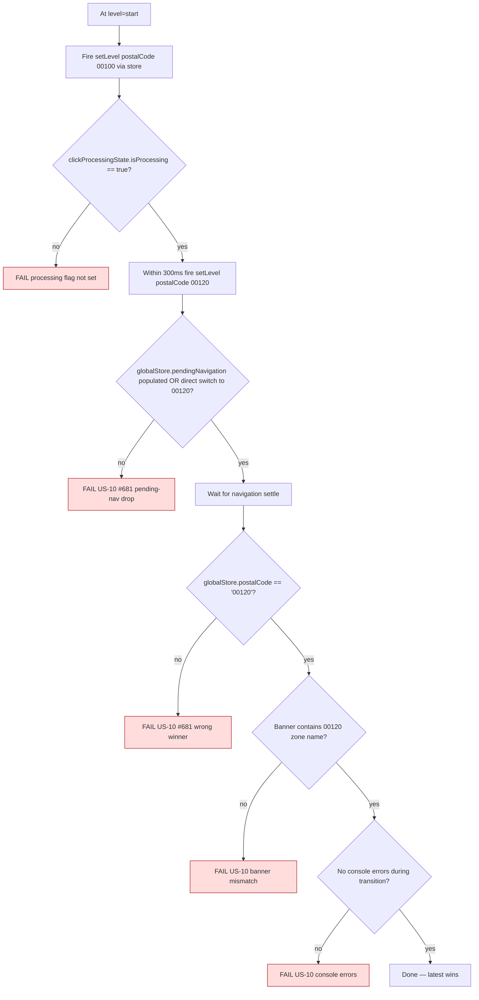

# Journey 6 — Latest-wins under rapid clicks

Mika clicks postal code A then postal code B before A finishes loading. The architecture promises **latest-wins** via three coordinated mechanisms (see `.claude/rules/architecture.md`):

1. `BuildingLoader.cancelCurrentLoad()` aborts the in-flight request.
2. `globalStore.pendingNavigation` queues the most-recent click.
3. `toggleStore.onEnterPostalCode()` keeps grid visibility consistent across the transition.

The audit could not exercise this from chrome-devtools because there's no deterministic way to fire two map clicks at sub-500 ms intervals from the MCP. The journey defines the Playwright recipe that proves the contract via direct store manipulation.

## Persona satisfaction journey



## Flow & sequence

The flow is best shown as a sequence diagram because it has to encode _time_ between the two clicks.



## Flow & assertions



## Test recipe (direct store manipulation)

The audit notes Cesium picking is unreliable for sub-500 ms double clicks, so the spec uses the **store method** (`drillToLevel('postalCode', '00100', { method: 'store' })`). To simulate the race, fire two `setNavigationLevel` calls back-to-back inside the same `page.evaluate` block so they both land before any reactive watcher can settle.

```typescript
await cesiumPage.evaluate(() => {
	const store = (window as any).globalStore;
	store.setLevel('postalCode');
	store.setPostalCode('00100');
	// Race: same tick, second update should win
	store.setLevel('postalCode');
	store.setPostalCode('00120');
});
```

## Coverage

| Step                                         | Story | Assertion                                                                     | Test                                           |
| -------------------------------------------- | ----- | ----------------------------------------------------------------------------- | ---------------------------------------------- | ---------------- |
| First navigation creates processing flag     | US-10 | `clickProcessingState.isProcessing === true` after first call                 | `journey-6-race` (new)                         |
| Second click queues pending or wins directly | US-10 | After both calls, `pendingNavigation` is non-null or `postalCode === '00120'` | `journey-6-race` — expected to fail until #681 |
| Latest wins                                  | US-10 | After settle, `postalCode === '00120'`                                        | `journey-6-race`                               |
| No errors during transition                  | US-10 | `pageerror` listener captures nothing matching `/cannot read                  | undefined/i`                                   | `journey-6-race` |
