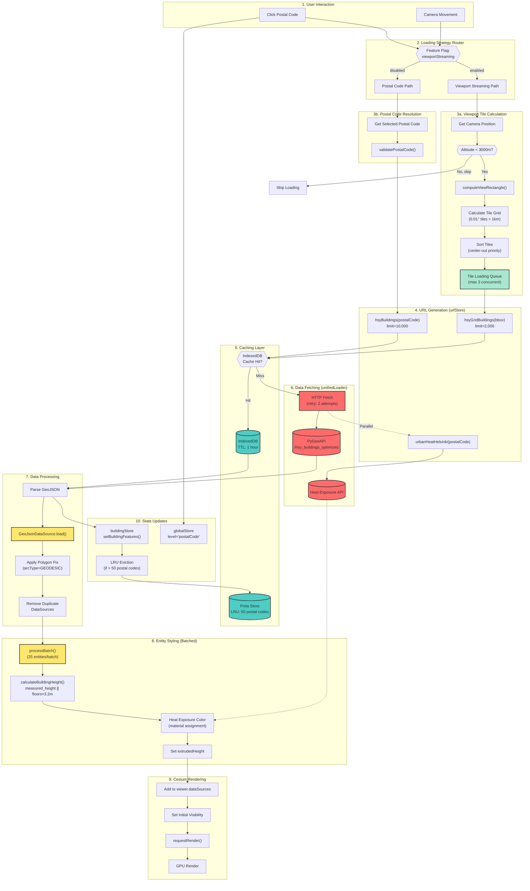
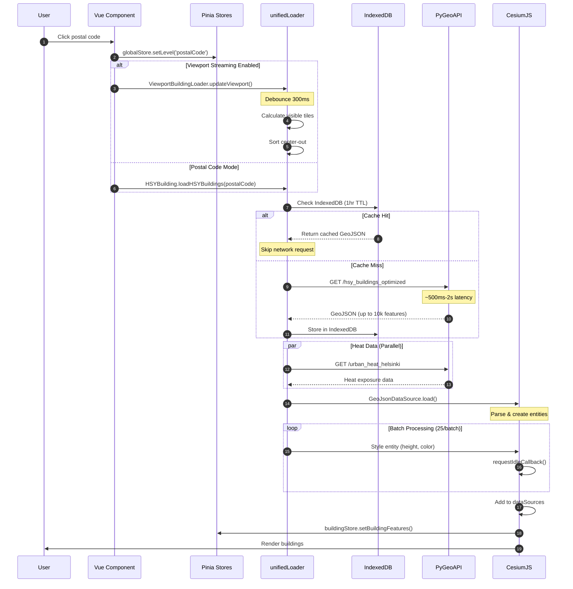
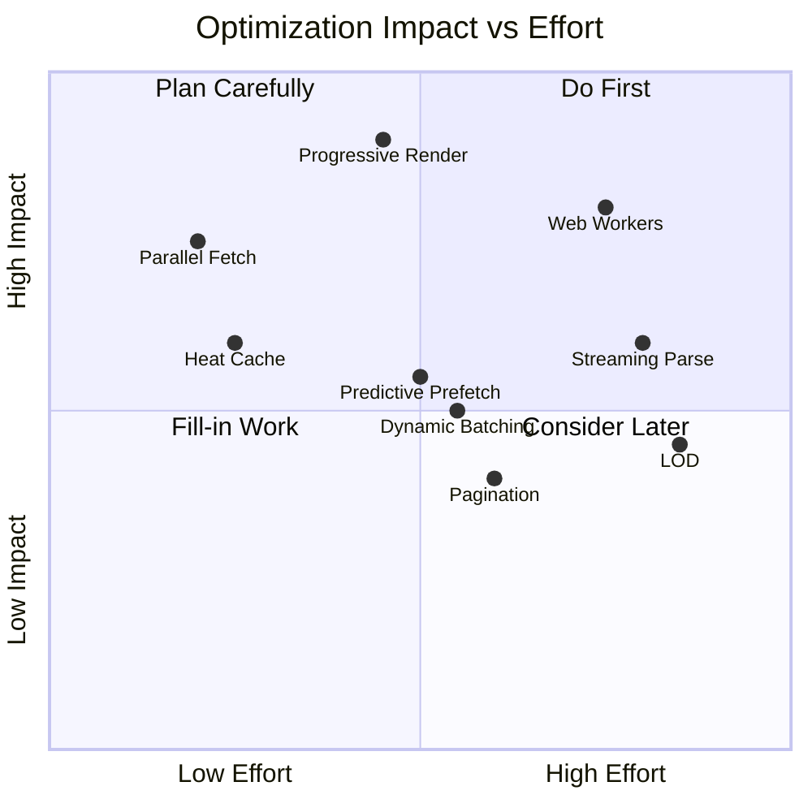

# Building Data Pipeline - Performance Analysis

## Overview

This document maps the complete data flow from user interaction to rendered buildings on screen, identifying critical paths and optimization opportunities.

## Pipeline Diagram



## Sequence Diagram (Critical Path)



## Performance Metrics by Stage

| Stage                   | Typical Duration | Bottleneck Risk | Optimization Potential   |
| ----------------------- | ---------------- | --------------- | ------------------------ |
| URL Generation          | <1ms             | None            | -                        |
| Cache Check             | 5-20ms           | Low             | -                        |
| HTTP Fetch (cache miss) | 500ms-2s         | **High**        | Prefetching, compression |
| GeoJSON Parse           | 50-200ms         | Medium          | Streaming parse          |
| Entity Creation         | 100-500ms        | **High**        | Web Workers              |
| Batch Styling           | 200-800ms        | **High**        | Parallel processing      |
| Cesium Render           | 50-200ms         | Medium          | LOD, culling             |
| **Total (cache miss)**  | **1-4s**         | -               | -                        |
| **Total (cache hit)**   | **400ms-1.5s**   | -               | -                        |

## Current Optimizations

### Already Implemented ✅

1. **IndexedDB Caching** (1-hour TTL)
   - Location: `unifiedLoader.js`
   - Impact: Eliminates network latency on repeat visits

2. **LRU Memory Cache** (50 postal codes)
   - Location: `buildingStore.js:29`
   - Impact: Fast tooltip data access

3. **Batch Processing** (25 entities/batch with idle callbacks)
   - Location: `batchProcessor.js`
   - Impact: Prevents UI blocking during styling

4. **Camera Debouncing** (300ms)
   - Location: `viewportBuildingLoader.js:60`
   - Impact: Prevents API hammering during pan/zoom

5. **Center-Out Tile Priority**
   - Location: `viewportBuildingLoader.js:378-417`
   - Impact: Loads visible content first

6. **Concurrent Load Limiting** (3 parallel tiles)
   - Location: `viewportBuildingLoader.js:425`
   - Impact: Balances throughput vs resource usage

7. **Altitude-Based Loading** (skip if >3000m)
   - Location: `viewportBuildingLoader.js:261`
   - Impact: Avoids loading invisible buildings

## Identified Bottlenecks 🔴

### 1. Sequential Heat Data Fetch

**Location:** `urbanheat.js:111`

```
Building fetch → Wait → Heat fetch → Wait → Merge
```

**Impact:** Adds 200-500ms to critical path

### 2. Single-Threaded Entity Styling

**Location:** `buildingStyler.js:76-98`

```
For each entity: calculate height → apply color → set extrusion
```

**Impact:** 200-800ms for 1000+ buildings, blocks main thread between batches

### 3. No Progressive Rendering

**Current:** Wait for all processing → render all at once
**Impact:** User sees nothing until complete pipeline finishes

### 4. Building Count Limits May Truncate

**Location:** `urlStore.js:136, 149`

- `hsyBuildings`: 10,000 limit
- `hsyGridBuildings`: 2,000 limit
  **Impact:** Dense areas may have missing buildings

### 5. Heat Data Not Separately Cached

**Location:** `urbanheat.js`
**Impact:** Re-fetched even when building geometry cached

## Optimization Recommendations 🚀

### High Impact (Recommended)

#### 1. Parallel Heat + Building Fetch

**Current:** Sequential
**Proposed:**

```javascript
// In buildingLoader.js or hsybuilding.js
const [buildingData, heatData] = await Promise.all([
	unifiedLoader.loadLayer(buildingConfig),
	unifiedLoader.loadLayer(heatConfig), // Separate cached layer
]);
mergeBuildingWithHeat(buildingData, heatData);
```

**Expected Improvement:** 200-500ms reduction
**Effort:** Low

#### 2. Progressive Rendering (Show Geometry First)

**Current:** Wait for full styling before render
**Proposed:**

```javascript
// Phase 1: Immediate render with default styling
const dataSource = await addDataSourceWithPolygonFix(data, name);
viewer.dataSources.add(dataSource);
requestRender(); // User sees buildings immediately

// Phase 2: Background styling (non-blocking)
queueMicrotask(async () => {
	await applyHeightExtrusion(dataSource.entities);
	await applyHeatColors(dataSource.entities, heatData);
	requestRender();
});
```

**Expected Improvement:** Perceived load time from 1-4s → <500ms
**Effort:** Medium

#### 3. Web Worker for Entity Styling

**Current:** Main thread batch processing
**Proposed:** Offload calculations to Web Worker

```javascript
// worker.js
self.onmessage = ({ data: { features, heatData } }) => {
	const styled = features.map((f) => ({
		id: f.id,
		height: calculateHeight(f.properties),
		color: calculateHeatColor(f.properties, heatData),
	}));
	self.postMessage(styled);
};

// main thread - just apply pre-calculated values
worker.onmessage = ({ data: styled }) => {
	styled.forEach((s) => applyToEntity(s.id, s.height, s.color));
};
```

**Expected Improvement:** 50-70% reduction in main thread blocking
**Effort:** High

#### 4. Separate Heat Data Cache Layer

**Current:** Heat data fetched per building load
**Proposed:**

```javascript
// Add to unifiedLoader config
const heatConfig = {
	layerId: `heat_${postalCode}`,
	url: urlStore.urbanHeatHelsinki(postalCode),
	type: 'geojson',
	cacheTTL: 3600000, // 1 hour, same as buildings
};
```

**Expected Improvement:** Eliminates redundant heat API calls
**Effort:** Low

### Medium Impact

#### 5. Predictive Prefetching

**Current:** Load on demand
**Proposed:** Prefetch adjacent tiles/postal codes

```javascript
// In viewportBuildingLoader.js after loading visible tiles
const adjacentTiles = getAdjacentTiles(visibleTiles);
adjacentTiles.forEach((tile) => {
	// Low priority prefetch
	requestIdleCallback(() => prefetchTile(tile));
});
```

**Expected Improvement:** Instant load on pan to adjacent areas
**Effort:** Medium

#### 6. Streaming GeoJSON Parse

**Current:** Parse entire response before processing
**Proposed:** Use streaming JSON parser for large responses

```javascript
import { parser } from 'stream-json';
import { pick } from 'stream-json/filters/Pick';
import { streamArray } from 'stream-json/streamers/StreamArray';

// Process features as they arrive
const pipeline = response.body
	.pipeThrough(new TextDecoderStream())
	.pipeThrough(parser())
	.pipeThrough(pick({ filter: 'features' }))
	.pipeThrough(streamArray());
```

**Expected Improvement:** First buildings render 50% faster for large datasets
**Effort:** High

#### 7. Dynamic Batch Sizing

**Current:** Fixed 25 entities/batch
**Proposed:** Adjust based on frame budget

```javascript
const FRAME_BUDGET_MS = 16; // Target 60fps

async function adaptiveBatch(entities, processor) {
	let batchSize = 25;
	let i = 0;

	while (i < entities.length) {
		const start = performance.now();
		const batch = entities.slice(i, i + batchSize);
		await Promise.all(batch.map(processor));

		const elapsed = performance.now() - start;
		// Adjust batch size to stay within frame budget
		batchSize = Math.max(5, Math.min(100, Math.floor(batchSize * (FRAME_BUDGET_MS / elapsed))));

		i += batch.length;
		await yieldToMain();
	}
}
```

**Expected Improvement:** Smoother UI during loading
**Effort:** Medium

### Lower Priority

#### 8. LOD (Level of Detail) for Buildings

**Current:** Full detail always
**Proposed:** Simplified geometry at distance

```javascript
const distanceDisplayCondition = new Cesium.DistanceDisplayCondition(0, 5000);
entity.polygon.distanceDisplayCondition = distanceDisplayCondition;

// Add simplified version for far view
const simplifiedEntity = createSimplifiedBuilding(entity);
simplifiedEntity.polygon.distanceDisplayCondition = new Cesium.DistanceDisplayCondition(
	5000,
	50000
);
```

**Expected Improvement:** Better performance when zoomed out
**Effort:** High

#### 9. Increase API Limits with Pagination

**Current:** Hard limits (10k/2k)
**Proposed:** Implement pagination for dense areas

```javascript
async function* paginatedFetch(baseUrl, pageSize = 2000) {
	let offset = 0;
	let hasMore = true;

	while (hasMore) {
		const url = `${baseUrl}&limit=${pageSize}&offset=${offset}`;
		const data = await fetch(url).then((r) => r.json());
		yield data.features;
		hasMore = data.features.length === pageSize;
		offset += pageSize;
	}
}
```

**Expected Improvement:** No truncated results in dense areas
**Effort:** Medium

## Optimization Priority Matrix



## Recommended Implementation Order

1. **Parallel Heat + Building Fetch** - Quick win, low risk
2. **Separate Heat Data Cache** - Complements #1
3. **Progressive Rendering** - Major UX improvement
4. **Predictive Prefetching** - Seamless panning experience
5. **Dynamic Batch Sizing** - Smoother loading animation
6. **Web Workers** - For high-density areas

## Metrics to Track

After implementing optimizations, measure:

| Metric                         | Current Baseline | Target |
| ------------------------------ | ---------------- | ------ |
| Time to First Building (TTFB)  | ~1-2s            | <500ms |
| Time to Interactive (TTI)      | ~2-4s            | <1.5s  |
| Frame drops during load        | 10-30            | <5     |
| Cache hit rate                 | ~60%             | >80%   |
| Memory usage (50 postal codes) | ~200MB           | <150MB |
