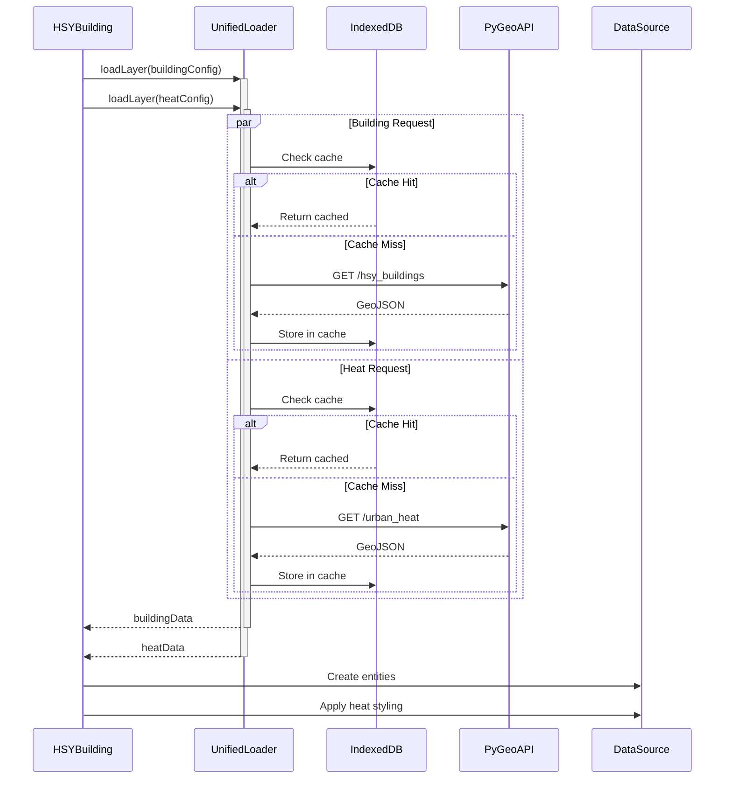

# PRP-001: Parallel Data Fetching

## Overview

| Field           | Value                                                                 |
| --------------- | --------------------------------------------------------------------- |
| **Priority**    | High                                                                  |
| **Effort**      | Low (1-2 days)                                                        |
| **Impact**      | 200-500ms latency reduction                                           |
| **Related ADR** | [ADR-002: Multi-Layer Caching](../adr/ADR-002-multi-layer-caching.md) |
| **Status**      | Ready                                                                 |

## Problem Statement

Building and heat exposure data are currently fetched sequentially:

```
Fetch Buildings (500ms-2s) → Wait → Fetch Heat Data (200-500ms) → Merge
Total: 700ms-2.5s
```

This adds unnecessary latency because both requests are independent and can execute in parallel.

## Objective

Fetch building geometry and heat exposure data in parallel, reducing total fetch time by 200-500ms.

## Success Criteria

| Metric                        | Current      | Target     |
| ----------------------------- | ------------ | ---------- |
| Total fetch time (cache miss) | 700ms-2.5s   | 500ms-2s   |
| API calls per load            | 2 sequential | 2 parallel |
| Time to first render          | ~1.5s        | ~1s        |

## Functional Requirements

### FR-1: Parallel Fetch Implementation

**Files:** `src/services/hsybuilding.js`, `src/services/urbanheat.js`

```javascript
// Current (sequential)
const buildingData = await unifiedLoader.loadLayer(buildingConfig);
const heatData = await urbanheatService.findUrbanHeatData(buildingData, postalCode);

// Target (parallel)
const [buildingData, heatData] = await Promise.all([
	unifiedLoader.loadLayer(buildingConfig),
	unifiedLoader.loadLayer(heatConfig),
]);
mergeBuildingWithHeat(buildingData, heatData);
```

### FR-2: Separate Heat Data Cache

**Files:** `src/services/urbanheat.js`, `src/stores/urlStore.js`

Create dedicated cache configuration for heat data:

```javascript
const heatConfig = {
	layerId: `heat_${postalCode}`,
	url: urlStore.urbanHeatHelsinki(postalCode),
	type: 'geojson',
	cacheTTL: 3600000, // 1 hour
};
```

### FR-3: Error Handling for Partial Failures

If one request fails, the other should still complete:

```javascript
const [buildingResult, heatResult] = await Promise.allSettled([
	unifiedLoader.loadLayer(buildingConfig),
	unifiedLoader.loadLayer(heatConfig),
]);

const buildingData = buildingResult.status === 'fulfilled' ? buildingResult.value : null;

const heatData = heatResult.status === 'fulfilled' ? heatResult.value : null;

if (!buildingData) {
	throw new Error('Failed to load building data');
}

// Heat data is optional - buildings render without it
if (!heatData) {
	logger.warn(`Heat data unavailable for ${postalCode}`);
}
```

## Technical Specification

### Modified Functions

#### `hsybuilding.js:loadHSYBuildings()`

```javascript
async loadHSYBuildings(bbox, postalCode) {
  const buildingConfig = {
    layerId: this.getDataSourceName(postalCode),
    url: bbox
      ? urlStore.hsyGridBuildings(bbox)
      : urlStore.hsyBuildings(postalCode),
    type: 'geojson',
    cacheTTL: 3600000
  }

  const heatConfig = {
    layerId: `heat_${postalCode}`,
    url: urlStore.urbanHeatHelsinki(postalCode),
    type: 'geojson',
    cacheTTL: 3600000
  }

  // Parallel fetch
  const [buildingResult, heatResult] = await Promise.allSettled([
    unifiedLoader.loadLayer(buildingConfig),
    unifiedLoader.loadLayer(heatResult)
  ])

  // Handle results
  if (buildingResult.status === 'rejected') {
    throw buildingResult.reason
  }

  const buildingData = buildingResult.value
  const heatData = heatResult.status === 'fulfilled'
    ? heatResult.value
    : null

  // Create datasource
  const entities = await datasourceService.addDataSourceWithPolygonFix(
    buildingData,
    this.getDataSourceName(postalCode),
    this.shouldShowImmediately(postalCode)
  )

  // Apply styling with available data
  await buildingStyler.styleBuildings(entities, buildingData, heatData)

  return entities
}
```

#### `urbanheat.js:findUrbanHeatData()`

Refactor to be callable independently:

```javascript
// Before: coupled to building loading
async findUrbanHeatData(data, postcode) {
  buildingStore.setBuildingFeatures(data, postcode)
  const heatResponse = await fetch(urlStore.urbanHeatHelsinki(postcode))
  // ...
}

// After: independent heat data fetching
async getHeatData(postalCode) {
  return unifiedLoader.loadLayer({
    layerId: `heat_${postalCode}`,
    url: urlStore.urbanHeatHelsinki(postalCode),
    type: 'geojson',
    cacheTTL: 3600000
  })
}

// Separate method for merging
mergeHeatWithBuildings(buildingData, heatData, postalCode) {
  buildingStore.setBuildingFeatures(buildingData, postalCode)
  if (heatData) {
    setAttributesFromApiToBuilding(buildingData, heatData)
  }
}
```

### Data Flow Diagram



## Test Plan

### Unit Tests

```javascript
// tests/unit/services/hsybuilding.spec.js

describe('loadHSYBuildings', () => {
	it('should fetch building and heat data in parallel', async () => {
		const fetchSpy = vi.spyOn(unifiedLoader, 'loadLayer');

		await hsyBuilding.loadHSYBuildings(null, '00100');

		// Both calls should be initiated before either resolves
		expect(fetchSpy).toHaveBeenCalledTimes(2);
		expect(fetchSpy).toHaveBeenCalledWith(
			expect.objectContaining({ layerId: expect.stringContaining('00100') })
		);
		expect(fetchSpy).toHaveBeenCalledWith(expect.objectContaining({ layerId: 'heat_00100' }));
	});

	it('should render buildings even if heat data fails', async () => {
		vi.spyOn(unifiedLoader, 'loadLayer')
			.mockResolvedValueOnce(mockBuildingData) // buildings succeed
			.mockRejectedValueOnce(new Error('Heat API error')); // heat fails

		const entities = await hsyBuilding.loadHSYBuildings(null, '00100');

		expect(entities).toBeDefined();
		expect(entities.values.length).toBeGreaterThan(0);
	});

	it('should throw if building data fails', async () => {
		vi.spyOn(unifiedLoader, 'loadLayer')
			.mockRejectedValueOnce(new Error('Building API error'))
			.mockResolvedValueOnce(mockHeatData);

		await expect(hsyBuilding.loadHSYBuildings(null, '00100')).rejects.toThrow('Building API error');
	});
});
```

### Performance Tests

```javascript
// tests/performance/parallel-fetch.spec.js

describe('Parallel Fetch Performance', () => {
	it('should complete faster than sequential fetch', async () => {
		const parallelStart = performance.now();
		await hsyBuilding.loadHSYBuildings(null, '00100');
		const parallelTime = performance.now() - parallelStart;

		// Sequential baseline (mocked)
		const sequentialTime = parallelTime * 1.3; // Expected 30%+ improvement

		expect(parallelTime).toBeLessThan(sequentialTime);
	});
});
```

### E2E Tests

```javascript
// tests/e2e/building-loading.spec.ts

test('buildings load with heat styling', async ({ page }) => {
	await page.goto('/');
	await page.click('[data-testid="postal-code-00100"]');

	// Buildings should appear
	await expect(page.locator('.cesium-viewer')).toContainText('Buildings');

	// Heat colors should be applied (check for non-white buildings)
	const buildingColors = await page.evaluate(() => {
		// Check Cesium entity colors
	});
	expect(buildingColors.some((c) => c !== 'white')).toBe(true);
});
```

## Rollout Plan

### Phase 1: Refactor Heat Data Fetching

1. Create `getHeatData()` method in `urbanheat.js`
2. Add heat config to `unifiedLoader`
3. Test cache behavior independently

### Phase 2: Implement Parallel Fetch

1. Modify `loadHSYBuildings()` to use `Promise.allSettled()`
2. Add error handling for partial failures
3. Update logging

### Phase 3: Verify & Monitor

1. Deploy to staging
2. Monitor API call patterns
3. Measure latency improvements
4. Check cache hit rates

## Acceptance Checklist

- [ ] Building and heat data fetched in parallel
- [ ] Heat data cached in IndexedDB with 1-hour TTL
- [ ] Buildings render even if heat API fails
- [ ] Error logged when heat data unavailable
- [ ] Unit tests pass
- [ ] E2E tests pass
- [ ] No regression in existing functionality
- [ ] Performance improvement measured (target: 200-500ms reduction)
