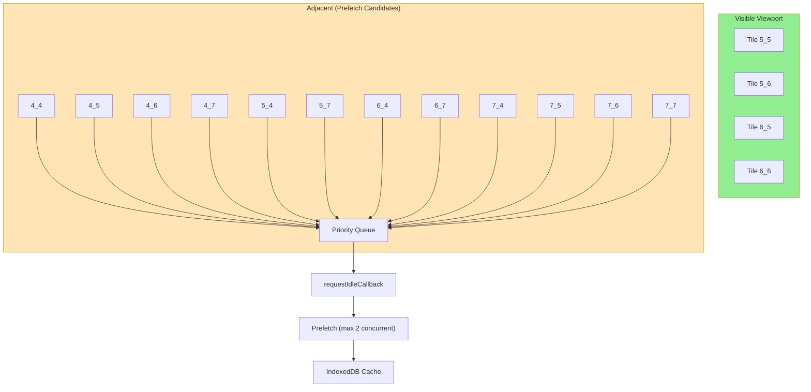

# PRP-002: Predictive Prefetching

## Overview

| Field           | Value                                 |
| --------------- | ------------------------------------- |
| **Priority**    | Medium                                |
| **Effort**      | Medium (3-5 days)                     |
| **Impact**      | Instant load on pan to adjacent areas |
| **Related ADR** | -                                     |
| **Status**      | Ready                                 |

## Problem Statement

When users pan the map to adjacent areas, they must wait for new building data to load. The current system only loads data for the visible viewport, resulting in noticeable loading delays during exploration.

### User Pain Points

1. **Exploration Friction**: Each pan requires waiting for new data
2. **Unpredictable Loading**: Users don't know when data will appear
3. **Wasted Idle Time**: Browser sits idle while user views current area

## Objective

Proactively prefetch building data for adjacent tiles/postal codes during idle time, enabling instant display when users pan to those areas.

## Success Criteria

| Metric                       | Current  | Target              |
| ---------------------------- | -------- | ------------------- |
| Time to render adjacent area | 500ms-2s | <100ms (from cache) |
| Cache hit rate on pan        | ~30%     | >70%                |
| Prefetch coverage            | 0%       | Adjacent 8 tiles    |

## Functional Requirements

### FR-1: Adjacent Tile Detection

Identify tiles adjacent to currently visible viewport:

```javascript
function getAdjacentTiles(visibleTiles, loadedTiles) {
	const adjacent = new Set();

	for (const tile of visibleTiles) {
		const [x, y] = tile.split('_').map(Number);

		// 8-directional adjacency
		const neighbors = [
			[x - 1, y - 1],
			[x, y - 1],
			[x + 1, y - 1],
			[x - 1, y],
			[x + 1, y],
			[x - 1, y + 1],
			[x, y + 1],
			[x + 1, y + 1],
		];

		for (const [nx, ny] of neighbors) {
			const key = `${nx}_${ny}`;
			if (!loadedTiles.has(key) && !visibleTiles.has(key)) {
				adjacent.add(key);
			}
		}
	}

	return adjacent;
}
```

### FR-2: Idle-Time Prefetching

Use `requestIdleCallback` to prefetch during browser idle periods:

```javascript
function schedulePrefetch(tiles) {
	const prefetchQueue = [...tiles];

	function prefetchNext(deadline) {
		while (prefetchQueue.length > 0 && deadline.timeRemaining() > 10) {
			const tile = prefetchQueue.shift();
			prefetchTile(tile); // Fire-and-forget, cache only
		}

		if (prefetchQueue.length > 0) {
			requestIdleCallback(prefetchNext, { timeout: 5000 });
		}
	}

	requestIdleCallback(prefetchNext, { timeout: 5000 });
}
```

### FR-3: Priority-Based Prefetching

Prioritize tiles based on likely pan direction:

```javascript
function prioritizeTiles(adjacentTiles, cameraVelocity) {
	return [...adjacentTiles].sort((a, b) => {
		const [ax, ay] = a.split('_').map(Number);
		const [bx, by] = b.split('_').map(Number);

		// Score based on alignment with camera velocity
		const scoreA = ax * cameraVelocity.x + ay * cameraVelocity.y;
		const scoreB = bx * cameraVelocity.x + by * cameraVelocity.y;

		return scoreB - scoreA; // Higher score = more likely direction
	});
}
```

### FR-4: Prefetch Budget Management

Limit prefetch to avoid overwhelming network/cache:

```javascript
const PREFETCH_CONFIG = {
	maxConcurrent: 2, // Max parallel prefetch requests
	maxPending: 8, // Max tiles in prefetch queue
	minIdleTime: 10, // Min ms idle time to start prefetch
	cooldownMs: 1000, // Wait after user interaction
	maxCacheSize: 100, // Max cached tiles (MB)
};
```

## Technical Specification

### Modified Files

#### `viewportBuildingLoader.js`

Add prefetch logic after viewport update:

```javascript
// In updateViewport() - after loading visible tiles
async updateViewport() {
  // ... existing viewport loading code ...

  // Schedule prefetch for adjacent tiles
  if (this.featureFlagStore.isEnabled('predictivePrefetch')) {
    this.schedulePrefetchForAdjacent()
  }
}

schedulePrefetchForAdjacent() {
  // Cancel any pending prefetch if user is actively moving
  if (this.isPanning) {
    this.cancelPrefetch()
    return
  }

  const visibleTiles = this.getVisibleTiles()
  const adjacentTiles = this.getAdjacentTiles(visibleTiles)
  const prioritized = this.prioritizeTiles(adjacentTiles, this.lastCameraVelocity)

  // Limit to top N tiles
  const tilesToPrefetch = prioritized.slice(0, PREFETCH_CONFIG.maxPending)

  this.prefetchQueue = tilesToPrefetch
  this.startPrefetch()
}

startPrefetch() {
  if (this.prefetchHandle) return  // Already running

  this.prefetchHandle = requestIdleCallback(
    (deadline) => this.processPrefetchQueue(deadline),
    { timeout: 5000 }
  )
}

async processPrefetchQueue(deadline) {
  while (
    this.prefetchQueue.length > 0 &&
    this.activePrefetches < PREFETCH_CONFIG.maxConcurrent &&
    deadline.timeRemaining() > PREFETCH_CONFIG.minIdleTime
  ) {
    const tile = this.prefetchQueue.shift()
    this.prefetchTile(tile)  // Don't await - fire and forget
  }

  // Continue if more tiles and not cancelled
  if (this.prefetchQueue.length > 0 && !this.prefetchCancelled) {
    this.prefetchHandle = requestIdleCallback(
      (deadline) => this.processPrefetchQueue(deadline),
      { timeout: 5000 }
    )
  } else {
    this.prefetchHandle = null
  }
}

async prefetchTile(tileKey) {
  this.activePrefetches++

  try {
    const bbox = this.tileToBbox(tileKey)
    const url = urlStore.hsyGridBuildings(bbox.toString())

    // Cache-only fetch - don't create datasource
    await unifiedLoader.loadLayer({
      layerId: `prefetch_${tileKey}`,
      url,
      type: 'geojson',
      cacheTTL: 3600000,
      cacheOnly: true  // New flag: store in cache but don't return data
    })

    logger.debug(`Prefetched tile ${tileKey}`)
  } catch (error) {
    // Prefetch failures are non-critical
    logger.debug(`Prefetch failed for ${tileKey}:`, error.message)
  } finally {
    this.activePrefetches--
  }
}

cancelPrefetch() {
  this.prefetchCancelled = true
  this.prefetchQueue = []
  if (this.prefetchHandle) {
    cancelIdleCallback(this.prefetchHandle)
    this.prefetchHandle = null
  }
  // Reset for next cycle
  setTimeout(() => {
    this.prefetchCancelled = false
  }, PREFETCH_CONFIG.cooldownMs)
}
```

#### `unifiedLoader.js`

Add `cacheOnly` option:

```javascript
async loadLayer(config) {
  const { cacheOnly = false, ...restConfig } = config

  // Check cache first
  const cached = await this.checkCache(config.layerId)
  if (cached) {
    return cacheOnly ? null : cached
  }

  // Fetch from network
  const data = await this.fetchWithRetry(config.url, config.retries)

  // Store in cache
  await this.storeInCache(config.layerId, data, config.cacheTTL)

  // For prefetch, don't return data (saves memory)
  return cacheOnly ? null : data
}
```

### Feature Flag

Add to `featureFlagStore.js`:

```javascript
predictivePrefetch: {
  enabled: false,  // Default off for initial rollout
  description: 'Prefetch adjacent tiles during idle time'
}
```

### Data Flow



## Test Plan

### Unit Tests

```javascript
describe('Predictive Prefetching', () => {
	describe('getAdjacentTiles', () => {
		it('should return 8 adjacent tiles for single visible tile', () => {
			const visible = new Set(['5_5']);
			const loaded = new Set();

			const adjacent = getAdjacentTiles(visible, loaded);

			expect(adjacent.size).toBe(8);
			expect(adjacent.has('4_4')).toBe(true);
			expect(adjacent.has('6_6')).toBe(true);
		});

		it('should exclude already loaded tiles', () => {
			const visible = new Set(['5_5']);
			const loaded = new Set(['4_4', '4_5']);

			const adjacent = getAdjacentTiles(visible, loaded);

			expect(adjacent.has('4_4')).toBe(false);
			expect(adjacent.has('4_5')).toBe(false);
		});
	});

	describe('prioritizeTiles', () => {
		it('should prioritize tiles in direction of camera movement', () => {
			const tiles = new Set(['4_5', '6_5']);
			const velocity = { x: 1, y: 0 }; // Moving right

			const prioritized = prioritizeTiles(tiles, velocity);

			expect(prioritized[0]).toBe('6_5'); // Right tile first
		});
	});

	describe('prefetch cancellation', () => {
		it('should cancel prefetch when user starts panning', async () => {
			const loader = new ViewportBuildingLoader();
			loader.schedulePrefetchForAdjacent();

			expect(loader.prefetchQueue.length).toBeGreaterThan(0);

			loader.cancelPrefetch();

			expect(loader.prefetchQueue.length).toBe(0);
			expect(loader.prefetchCancelled).toBe(true);
		});
	});
});
```

### Integration Tests

```javascript
describe('Prefetch Integration', () => {
	it('should populate cache for adjacent tiles', async () => {
		// Navigate to postal code
		await loadPostalCode('00100');

		// Wait for prefetch cycle
		await waitForIdle();

		// Check adjacent tiles are cached
		const adjacentTile = '5_6'; // Adjacent to 00100 area
		const cached = await indexedDB.get(`prefetch_${adjacentTile}`);

		expect(cached).toBeDefined();
	});

	it('should load prefetched tiles instantly', async () => {
		// Prefetch tile
		await prefetchTile('5_6');

		// Navigate to prefetched area
		const start = performance.now();
		await panToTile('5_6');
		const loadTime = performance.now() - start;

		expect(loadTime).toBeLessThan(100); // Should be instant from cache
	});
});
```

## Rollout Plan

### Phase 1: Feature Flag + Logging

1. Implement prefetch logic behind feature flag
2. Add detailed logging for prefetch events
3. Deploy to staging

### Phase 2: Internal Testing

1. Enable for internal users
2. Monitor cache hit rates
3. Collect performance metrics

### Phase 3: Gradual Rollout

1. Enable for 10% of users
2. Monitor server load
3. Increase to 50%, then 100%

## Acceptance Checklist

- [ ] Adjacent tiles detected correctly (8-directional)
- [ ] Prefetch runs only during idle time
- [ ] Prefetch cancelled on user interaction
- [ ] Priority based on camera direction
- [ ] Budget limits respected (concurrent, queue size)
- [ ] Feature flag controls prefetch
- [ ] Cache hit rate improved on pan
- [ ] No impact on visible area loading
- [ ] Logging for debugging
- [ ] Unit and integration tests pass
